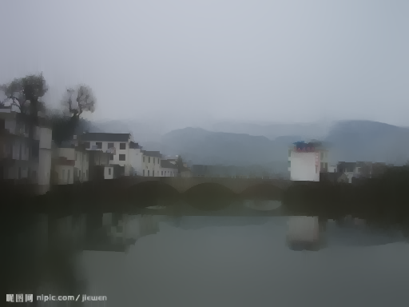

# Edge-preserving-filter
 This script is the torch implementation of the domain transform Recursive Filter 
  described in the paper:
  
    Domain Transform for Edge-Aware Image and Video Processing
    Eduardo S. L. Gastal and Manuel M. Oliveira
    ACM Transactions on Graphics. Volume 30 (2011), Number 4.
    Proceedings of SIGGRAPH 2011, Article 69.
    
# Requirements

 Torch 7 [https://github.com/torch/torch7]

# Arguments:

  RF Domain tranform recursive edge-preserving fitler

    F = RF(img, sigma_s, sigma_r, num_iterations, joint_image)

  Parameters:
    img:             input image to be filtered
    
    sigma_s:         Filter spatial standard deviation
    
    sigma_r:         Filter range standard deviation
    
    num_iterations   Number of iterations to perform (defualt: 3)
    
    joint_image      Optional image for joint filtering.
  
 
 # Results
<table style="width:100%">
<tr>
<td></td> <td></td>
<td></td> <td></td>
<td></td> <td></td>
</tr>
<tr>
<td>input ref1</td><td>RF result</td><td>input ref2</td><td>RF result2</td><td>input ref3</td><td>RF result3</td>
 </table>
</tr>

